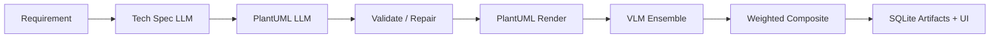

# UML Generation Thesis Application

**Author:** [Dipak Yadav](https://github.com/dipak5501)  
**Repository:** [github.com/dipak5501/uml-generation-pipeline](https://github.com/dipak5501/uml-generation-pipeline)

End-to-end **thesis demo application** that turns plain-English software requirements into design-phase UML diagrams (Class, Object, Component, Package), renders them with PlantUML, scores them with a multimodal VLM ensemble, and supports human evaluation + analytics.

This repository implements the system described in **Automated UML Dataset Generation from Natural-Language Requirements with Multimodal Verification for Software Design** (Dipak Yadav, Yutong Zhao).

## Architecture



## Quick start (local, mock mode)

```bash
git clone https://github.com/dipak5501/uml-generation-pipeline.git
cd uml-generation-pipeline

make install
# .env defaults to MOCK_PROVIDERS=true — no API keys required

# Terminal 1 — API
make api

# Terminal 2 — UI
make ui
```

- API docs: http://127.0.0.1:8000/docs  
- Streamlit UI: http://127.0.0.1:8501  

### Go live (public website)

See the full guide: [docs/deploy.md](docs/deploy.md)

Short version:
- **Quick demo:** run locally + `ngrok http 8501`
- **Stable site:** `docker compose up --build -d` on a cloud VM, or deploy API+UI on Railway/Render

### Demo dataset (CLI)

```bash
make demo
# or
PYTHONPATH=. MOCK_PROVIDERS=true python scripts/demo_generate.py -n 1
```

### Tests

```bash
make test
```

### Docker

```bash
make docker-up
# API :8000  UI :8501
```

## PlantUML / Java

Rendering requires a JDK. The PlantUML jar auto-downloads to `tools/plantuml.jar` on first render.

```bash
# macOS
brew install --cask temurin
```

Check health: `GET /api/settings/health`

## Model providers

| Mode | Config | Notes |
|------|--------|-------|
| Mock (default) | `MOCK_PROVIDERS=true` | Offline thesis demo |
| Ollama | `MOCK_PROVIDERS=false` `USE_OLLAMA=true` | Local LLMs/VLMs |
| OpenAI-compatible | `MOCK_PROVIDERS=false` + `OPENAI_API_KEY` | Cloud / vLLM |

VLM weights from the paper (MMMU): Qwen2.5-VL-3B **53.1**, LLaMA-3.2-11B-Vision **50.7**, Aya-Vision-8B **39.9**.

Composite score uses only scores `> 0`; if none are valid (including render failure), final score = **0**.

## UI pages

1. Dashboard  
2. Single Generation (full artifact trace)  
3. Batch Generation  
4. Artifact Review  
5. Human Evaluation (rubric)  
6. Analytics + export links  
7. Settings / health  

## API highlights

- `POST /api/generate`  
- `POST /api/generate/batch`  
- `GET /api/jobs/{id}`  
- `GET /api/artifacts/{id}` (+ `/image`, `/plantuml`)  
- `POST /api/artifacts/{id}/rescore` / `/repair`  
- `POST /api/human-review`  
- `GET /api/analytics/summary` / `/distributions`  
- `GET /api/export/dataset?fmt=jsonl|csv|parquet`  

## Project layout

```
app/            FastAPI + SQLModel services
ui/             Streamlit multipage demo
uml_pipeline/   Original research pipeline (reused)
prompts/        Versioned prompt templates
docs/           Gap analysis + implementation plan
sample_data/    Demo requirements
tests/          Unit + API + e2e smoke tests
paper/          LaTeX paper (Overleaf sync)
```

## Research paper / Overleaf

**Automated UML Dataset Generation from Natural-Language Requirements with Multimodal Verification for Software Design** — see [paper/README.md](paper/README.md). Gap analysis: [docs/gap_analysis.md](docs/gap_analysis.md).

## Legacy CLI (still available)

| Task | Command |
|------|---------|
| Download benchmark data | `python scripts/download_datasets.py` |
| Render diagrams | `python scripts/render_diagrams.py --limit 20` |
| Analyze scores | `python scripts/analyze_dataset.py` |
| Generate (legacy batch) | `python scripts/run_generation.py --diagram-type class -n 10` |

## License

MIT — see [LICENSE](LICENSE).
