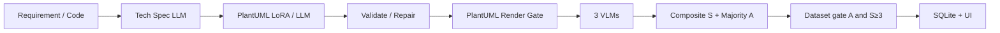

# UML-Pipeline

**Author:** [Dipak Yadav](https://github.com/dipak5501)  
**Repository:** [github.com/dipak5501/uml-generation-pipeline](https://github.com/dipak5501/uml-generation-pipeline)

End-to-end application that turns plain-English software requirements **or source code** (Java, Python, C) into design-phase UML diagrams (**Class, Object, Component, Package**), renders them as **black-and-white** PlantUML PNGs, scores them with a multimodal VLM ensemble (weighted composite **S** + majority-vote gate **A**), and supports human evaluation, analytics, and dataset export.

> **Note:** The API and UI accept four diagram types (`class`, `object`, `component`, `package`). Flowchart/activity diagrams appear in training corpora and legacy docs but are **not** exposed on `/api/generate`.

This repository implements the system described in **Automated UML Dataset Generation from Natural-Language Requirements with Multimodal Verification for Software Design** (Dipak Yadav, Yutong Zhao).

**Full architecture:** [docs/SYSTEM_DESIGN.md](docs/SYSTEM_DESIGN.md)

<!-- LIVE_DEMO_BEGIN -->
**Live demo (as of 2026-09-06):**

- **UI:** [https://volt-linking-funny-teaches.trycloudflare.com](https://volt-linking-funny-teaches.trycloudflare.com)
- **API:** [https://deviation-flowers-feelings-herb.trycloudflare.com](https://deviation-flowers-feelings-herb.trycloudflare.com)
- **Agent:** [https://deviation-flowers-feelings-herb.trycloudflare.com/api/agent](https://deviation-flowers-feelings-herb.trycloudflare.com/api/agent)

Quick-tunnel URLs rotate on restart. This block is rewritten by `scripts/tunnel_notify.py` whenever tunnels publish (GitHub is updated via `scripts/git_auto_push.sh`). Always-current copy: [Link.md](Link.md). On the Mac Studio: `data/run/public_ui_url.txt`, `data/run/public_api_url.txt`.
<!-- LIVE_DEMO_END -->

---

## Production stack (Math dept Mac Studio)

The primary deployment runs **24/7** on the **Math department Mac Studio (M1 Ultra, 128 GB)** via macOS user LaunchAgents — **no Azure dependency**:

| Component | Production default |
|-----------|-------------------|
| API / UI | FastAPI `:8000` + Streamlit `:8501` |
| Database | SQLite `data/uml_app.db` |
| Spec LLM | Ollama `llama3.2:1b` |
| PlantUML | MLX LoRA Qwen2.5-0.5B (`models/uml-plantuml-lora-sourcecode-30k`; warm-started from 200k) |
| VLM #1 | Ollama **0.32** `:11435` → `qwen2.5vl:3b` |
| VLM #2 | Ollama **0.24** `:11434` → `llama3.2-vision:11b` |
| VLM #3 | Local Transformers **Aya-Vision-8B** (`VLM_AYA_BACKEND=local`) |
| Public access | Cloudflare quick tunnels + user LaunchAgents |
| Supervision | `scripts/install_macos_user_server.sh` |

```bash
# Always-on (API, UI, Ollama, tunnels, GitHub Link.md publisher). No sudo.
# Survives Cursor quit and screen lock. Do NOT Log Out this macOS user.
bash scripts/install_macos_user_server.sh
bash scripts/macos_server_status.sh
```

---

## Architecture



---

NVIDIA CUDA machines must **retrain** with `make finetune-cuda` (MLX adapters will not load). See [docs/CURSOR_GPU_HANDOFF.md](docs/CURSOR_GPU_HANDOFF.md).

## Quick start (local)

```bash
git clone https://github.com/dipak5501/uml-generation-pipeline.git
cd uml-generation-pipeline

make install
cp .env.example .env   # MOCK_PROVIDERS=true for offline demo

# One command (API :8000 + UI :8501)
make run

# Or two terminals:
# make api
# make ui
```

- Streamlit UI: http://127.0.0.1:8501  
- API docs: http://127.0.0.1:8000/docs  

### Live local stack (Ollama + LoRA + Aya)

```bash
# Dual Ollama (0.24 on :11434, 0.32 on :11435) — started by make run
ollama pull llama3.2:1b qwen2.5vl:3b llama3.2-vision:11b

# In .env:
MOCK_PROVIDERS=false
USE_OLLAMA=true
USE_HF_INFERENCE=false
USE_FINETUNED_CODE=true
FINETUNED_ADAPTER_PATH=models/uml-plantuml-lora-sourcecode-30k
VLM_AYA_BACKEND=local

make run
bash scripts/restart_api.sh   # after .env changes when using LaunchAgents
```

Setup helper for paper-exact Aya: `bash scripts/setup_paper_aya_local.sh`

### Public demo (Cloudflare tunnels)

```bash
bash scripts/start_public_tunnels.sh
# URLs → data/run/public_ui_url.txt and the Live demo block above / Link.md
```

Set `API_ACCESS_TOKEN` in `.env` before exposing tunnels. Streamlit attaches Bearer auth automatically.

---

## Training corpus and LoRA

| Stage | Command | Output |
|-------|---------|--------|
| 8k starter | `make training-corpus` | `data/training/uml_training_8000.parquet` |
| 50k HF/web | `make train-50k` | `models/uml-plantuml-lora-50k` (15k iters; superseded) |
| 100k merged | `make train-100k` | `models/uml-plantuml-lora-100k` (18k iters; superseded) |
| 200k combined | `make train-200k` | `models/uml-plantuml-lora-200k` (20k iters; superseded) |
| 10k source-code (interim) | — | `models/uml-plantuml-lora-source10k` (superseded) |
| **30k source-code (Java/Python/C)** | `make train-source30k` | `models/uml-plantuml-lora-sourcecode-30k` (**production**, 6k iters, warm-started from 200k) |

Corpus merges open Hugging Face UMLCode datasets with web PlantUML, a **50k source-code block**, and a **30k per-language block** (10k Java, 10k Python, 10k C). Details: [models/README.md](models/README.md), [docs/SYSTEM_DESIGN.md](docs/SYSTEM_DESIGN.md#8-data-lake-and-training-design).

After training completes, point `.env` at the new adapter and restart the API:

```bash
FINETUNED_ADAPTER_PATH=models/uml-plantuml-lora-sourcecode-30k
bash scripts/restart_api.sh
```

---

## Model providers

| Mode | Config | Notes |
|------|--------|-------|
| Mock (default) | `MOCK_PROVIDERS=true` | Offline; no API keys |
| **Ollama (production)** | `MOCK_PROVIDERS=false` `USE_OLLAMA=true` | Dual-host for Qwen-VL + LLaMA-Vision |
| LoRA PlantUML | `USE_FINETUNED_CODE=true` | Apple Silicon MLX; Stage 2 only |
| Local Aya VLM | `VLM_AYA_BACKEND=local` | Paper-exact 3rd scorer; not on Ollama |
| Hugging Face | `USE_HF_INFERENCE=true` + `HF_TOKEN` | Optional cloud inference |
| OpenAI-compatible | `OPENAI_API_KEY` | vLLM / cloud fallback |

Composite score (thesis formula): MMMU-weighted average of all three VLM scores (0–6; zeros count). Render failure forces **S = 0**. Dataset entry requires majority **A = 1** (τ = 4, ≥ 2/3 models) and **S ≥ 3**.

---

## UI pages

1. Dashboard  
2. Single Generation (full artifact trace)  
2b. **UML Copilot** (chat → generate / correct on Mac Studio Ollama + LoRA)  
3. Batch Generation  
4. Generated Diagrams (history gallery)  
5. Human Evaluation (rubric)  
6. Analytics + export links  
7. Settings / health  
8. System Design (architecture overview)  

---

## API highlights

Auth (when `API_ACCESS_TOKEN` set): `Authorization: Bearer <token>` or `X-API-Key`.

- `POST /api/generate` — `input_mode`: `requirement` | `source_code`  
- `POST /api/generate/batch`  
- `POST /api/copilot/turn` — chat / generate / correct (Ollama dialogue + pipeline)  
- `GET /api/copilot/health` — local chat model readiness  
- `GET /api/jobs/{id}`  
- `GET /api/artifacts/{id}` (+ `/image`, `/plantuml`)  
- `POST /api/artifacts/{id}/rescore` / `/repair`  
- `POST /api/human-review`  
- `GET /api/analytics/summary` / `/distributions`  
- `GET /api/export/dataset?fmt=jsonl|csv|parquet`  
- `GET /api/settings/health`  
- `GET /api/agent/health` — remote command agent (see [Link.md](Link.md))

### Remote command agent

Control the Mac Studio server from any device when away from the machine. The public URL is kept in repo root [`Link`](Link) / [`Link.md`](Link.md) (auto-updated when Cloudflare tunnels restart).

```bash
export AGENT="https://deviation-flowers-feelings-herb.trycloudflare.com/api/agent"
export TOKEN="your-api-access-token"   # from .env on the server — never commit

curl -s "$AGENT/health" | python3 -m json.tool
curl -s -X POST "$AGENT/command" \
  -H "Authorization: Bearer $TOKEN" \
  -H "Content-Type: application/json" \
  -d '{"command":"health"}'
```

Allowlisted commands: `health`, `restart-api`, `restart-ui`, `restart-tunnels`, `publish-urls`, `pull-main`, `smoke-test`, `generate`, `training-status`, `server-status`, `agent-prompt` (requires `CURSOR_API_KEY`).

---

## Project layout

```
app/           FastAPI + SQLModel services, provider factory, orchestration
ui/            Streamlit multipage UI
uml_pipeline/  Research pipeline (render, scoring, LLM client)
prompts/       Versioned prompt templates
models/        MLX LoRA adapters (production: sourcecode-30k; prior: 50k/100k/200k/source10k)
data/          SQLite, artifacts, training corpora, tunnel state
scripts/       Deploy, training, tunnels, LaunchAgents
docs/          SYSTEM_DESIGN.md, deploy, demo flow, gap analysis
tests/         Unit + API + e2e smoke tests
paper/         LaTeX paper (Overleaf sync)
```

---

## Deployment options

| Environment | Guide |
|-------------|-------|
| **Mac Studio (production)** | [docs/SYSTEM_DESIGN.md](docs/SYSTEM_DESIGN.md#9-deployment-and-operations) |
| Render / Railway / Docker | [docs/deploy.md](docs/deploy.md) |
| GitHub Pages landing | https://dipak5501.github.io/uml-generation-pipeline/ |

---

## PlantUML / Java

Rendering requires a JDK. The PlantUML jar auto-downloads to `tools/plantuml.jar` on first render.

```bash
make install-java   # or: brew install --cask temurin
```

Check health: `GET /api/settings/health`

---

## Demo and tests

```bash
make demo          # mock single artifact
make test          # pytest (153 tests, MOCK_PROVIDERS=true)
make smoke         # live API smoke (9/9 pass; composite scores 4.72–6.00)
```

**Golden fixtures:** 21 cases (6 NL + 15 source-code) under `tests/golden/`. Progress notes: `reports/REVIEWER_PROGRESS_REPORT.md`. Thesis–application work report (2026-08-31): `reports/Thesis_Application_Work_Report.md`. GPU handoff: `docs/CURSOR_GPU_HANDOFF.md`.

---

## Research paper / Overleaf

**Automated UML Dataset Generation from Natural-Language Requirements with Multimodal Verification for Software Design** — see [paper/README.md](paper/README.md). Technical report: [reports/PUBLICATION_TECHNICAL_REPORT.md](reports/PUBLICATION_TECHNICAL_REPORT.md).

---

## Legacy CLI (still available)

| Task | Command |
|------|---------|
| Download benchmark data | `python scripts/download_datasets.py` |
| Render diagrams | `python scripts/render_diagrams.py --limit 20` |
| Analyze scores | `python scripts/analyze_dataset.py` |
| Generate (legacy batch) | `python scripts/run_generation.py --diagram-type class -n 10` |

---

## License

MIT — see [LICENSE](LICENSE).
