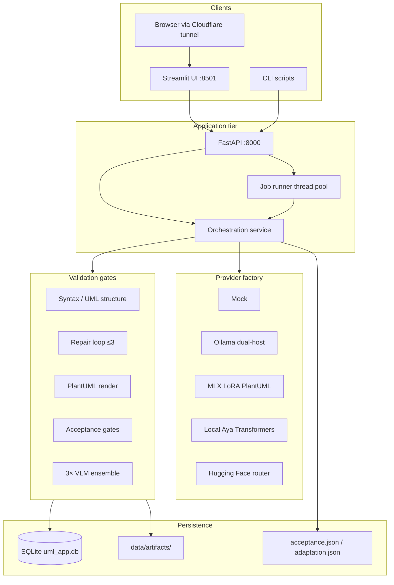

# UML-Pipeline — System Design

**Last updated:** 2026-08-28  
**Paper:** *Automated UML Dataset Generation from Natural-Language Requirements with Multimodal Verification for Software Design* (Dipak Yadav, Yutong Zhao)  
**Repository:** [github.com/dipak5501/uml-generation-pipeline](https://github.com/dipak5501/uml-generation-pipeline)

This document describes the **production architecture** of UML-Pipeline as deployed on a local Apple Silicon Mac Studio. It replaces earlier mock-only or cloud/Azure-oriented notes. There is **no Azure dependency** in the current stack.

---

## 1. Executive summary

UML-Pipeline is a full-stack application that converts natural-language software requirements **or source code** (Java, Python, C) into design-phase UML diagrams (class, object, component, package), renders them as black-and-white PNGs via PlantUML, scores them with a three-model vision ensemble, and persists complete artifact traces in SQLite for review, analytics, and dataset export.

> **Diagram types:** The API (`app/schemas.py`) exposes four types: `class`, `object`, `component`, `package`. Flowchart/activity diagrams exist in training corpora and internal validators but are not accepted on `/api/generate`.

| Layer | Technology |
|-------|------------|
| API | FastAPI + Uvicorn (`:8000`) |
| UI | Streamlit multipage (`:8501`) |
| Database | SQLite (`data/uml_app.db`); optional Postgres via `DATABASE_URL` |
| Jobs | In-process thread pool (no Redis/Celery) |
| Inference | Dual Ollama daemons, MLX LoRA, local Transformers (Aya) |
| Rendering | Local JDK + `tools/plantuml.jar` (preferred); optional remote PlantUML HTTP |
| Public access | Cloudflare quick tunnels (`cloudflared`) |
| Process supervision | macOS user LaunchAgents (no admin/sudo) |

---

## 2. Hardware and runtime environment

Production host (Math department Mac Studio, measured 2026-08-28):

| Item | Value |
|------|-------|
| Machine | Apple Mac Studio |
| SoC | M1 Ultra |
| RAM | 128 GB unified memory |
| OS | macOS (arm64), 24/7 via user LaunchAgents |
| Python | 3.11+ (local venv at `.venv/`) |

The unified memory footprint allows concurrent operation of: dual Ollama servers, local Aya-Vision-8B (Transformers/MPS), MLX LoRA inference, FastAPI, Streamlit, and long-running LoRA training jobs.

---

## 3. High-level architecture



ASCII equivalent:

```text
[Streamlit / CLI / Public browser]
              │
              ▼
         [FastAPI :8000]
              │
    ┌─────────┴─────────┐
    ▼                   ▼
[Job queue]      [Orchestration]
 (in-process)     requirement → spec → PlantUML
                        │ validate ⇄ repair
                        ▼ render PNG
                        ▼ 3× VLM → S + A
                        ▼ SQLite + data/artifacts/
```

---

## 4. Pipeline stages

Core logic lives in `app/services/orchestration.py` (`run_single_generation`). Stages align with the research paper but use pragmatic local stand-ins where 32B models are impractical on-device.

### Stage 0 — Input intake

- **Requirement mode** (`input_mode=requirement`): free-text software requirement.
- **Source-code mode** (`input_mode=source_code`): pasted or uploaded code; language auto-detected (`app/services/code_analysis.py`).
- Structured technical specification is produced in both cases (Stage 1).

### Stage 1 — Technical specification (Spec LLM)

| Paper | Production default |
|-------|-------------------|
| Llama-3.2-1B-Instruct | Ollama `llama3.2:1b` on `:11434` |

Provider: `build_chat_provider()` in `app/providers/factory.py`. Output is JSON-structured spec with validity metrics (`app/services/spec_json.py`).

### Stage 2 — PlantUML generation (Code LLM + CoT)

| Paper | Production default |
|-------|-------------------|
| DeepSeek-R1-Distill-Qwen-32B | **MLX LoRA** on `mlx-community/Qwen2.5-0.5B-Instruct-4bit` |

When `USE_FINETUNED_CODE=true`, `build_code_provider()` loads the LoRA adapter from `FINETUNED_ADAPTER_PATH`. Chain-of-thought prompting is enabled (`enable_cot`); private reasoning is stripped before persistence.

**Black-and-white policy:** prompts and the finetune system message require plain UML only — no `skinparam` colors, themes, or hex fills. See `scripts/prepare_finetune_data.py` (`SYSTEM` constant).

**Fallback chain:**

1. LoRA output (when enabled and diagram type supported)
2. Base chat provider (Ollama spec model; DeepSeek-32B is not run locally)
3. Grounded spec-builder (`plantuml_from_spec`) for validation/fidelity failures
4. Typed safe template as last resort

**Adaptation memory** (`data/adaptation_memory.json`) records generator/strategy choices per diagram type for incremental improvement.

### Stage 2b — Validate and repair

Multi-layer checks before and after render:

| Gate | Module | Purpose |
|------|--------|---------|
| Syntax | `plantuml_validate.py` | `@startuml`/`@enduml`, basic structure |
| Compile | `uml_pipeline.render.check_plantuml_syntax` | Java + PlantUML JAR dry-run |
| UML rules | `uml_structure.py` | Diagram-type-specific constraints |
| Consistency | `plantuml_from_spec.fidelity_report` | Spec entity/recall coverage |
| Semantics | `traceability.py` | Requirement traceability |

Repair loop: up to `MAX_REPAIR_ATTEMPTS` (default 3) via `app/services/repair.py`. Sidecars: `data/artifacts/{id}/acceptance.json`, `adaptation.json`.

### Stage 3 — Render gate

Local Java + `tools/plantuml.jar` when `PLANTUML_PREFER_LOCAL=true`. Render failure forces composite score **S = 0** (paper render gate δ).

PNG written to `data/artifacts/{artifact_id}/{hash}.png`.

### Stage 4 — VLM ensemble scoring

Three vision models score the rendered PNG (0–6 scale):

| Weight key | MMMU weight | Paper model | Production routing |
|------------|-------------|-------------|-------------------|
| `qwen25vl3b` | 53.1 | Qwen2.5-VL-3B-Instruct | Ollama **0.32** on `:11435` → `qwen2.5vl:3b` |
| `llama32vl11b` | 50.7 | LLaMA-3.2-11B-Vision-Instruct | Ollama **0.24** on `:11434` → `llama3.2-vision:11b` |
| `aya_vision_8b` | 39.9 | Aya-Vision-8B | **Local Transformers** (`VLM_AYA_BACKEND=local`) — not on Ollama |

**Dual-Ollama rationale:** Ollama 0.32 runs Qwen2.5-VL but cannot load LLaMA-3.2-Vision (`mllama`). Ollama 0.24 loads LLaMA-Vision but not Qwen-VL. Both daemons are supervised by LaunchAgents (`scripts/launchd/run_ollama24.sh`, `run_ollama32.sh`).

Scoring formulas (`app/services/scoring.py`):

- **Composite S:** MMMU-weighted average over available numeric scores; render failure → S = 0.
- **Majority A:** A = 1 when ≥ 2 of 3 models score ≥ τ (default τ = 4).
- **Dataset entry:** render OK ∧ A = 1 ∧ S ≥ 3.0 (`MIN_COMPOSITE_FOR_DATASET`).

### Stage 5 — Persist

SQLModel entities in `data/uml_app.db`: jobs, requirements, specs, artifacts, render/repair attempts, per-model scores, composite score, human reviews. Full trace retrievable via API and Streamlit pages.

---

## 5. Provider factory

`app/providers/factory.py` centralizes provider construction:

| Function | Returns | When |
|----------|---------|------|
| `build_chat_provider()` | Mock / Ollama / HF / OpenAI | Stage 1 spec |
| `build_code_provider()` | MLX LoRA or chat provider | Stage 2 PlantUML |
| `build_base_code_provider()` | Non-LoRA fallback | Repair / package / flowchart |
| `build_vlm_providers()` | Dict of 3 VLM providers | Stage 4 scoring |

Mode selection (`.env`):

```bash
MOCK_PROVIDERS=false
USE_OLLAMA=true
USE_HF_INFERENCE=false
USE_FINETUNED_CODE=true
VLM_AYA_BACKEND=local
```

There is **no Azure OpenAI or Azure ML path** in this repository.

---

## 6. API design

Base URL: `http://127.0.0.1:8000` (Streamlit always uses localhost; public tunnel URLs are browser-only).

### Authentication

When `API_ACCESS_TOKEN` is set:

- Protected endpoints require `Authorization: Bearer <token>` **or** `X-API-Key: <token>`.
- Streamlit reads the same env var via `ui/api_client.py` and attaches Bearer auth automatically.
- Health (`GET /api/settings/health`) remains open for monitoring.

### Key endpoints

| Method | Path | Purpose |
|--------|------|---------|
| POST | `/api/generate` | Single generation (async default) |
| POST | `/api/generate/batch` | Batch job |
| GET | `/api/jobs/{id}` | Job status |
| GET | `/api/jobs/{id}/artifacts` | Artifacts for a job |
| GET | `/api/artifacts` | Filtered library |
| GET | `/api/artifacts/{id}` | Full trace |
| GET | `/api/artifacts/{id}/image` | PNG bytes |
| GET | `/api/artifacts/{id}/plantuml` | Raw PlantUML |
| POST | `/api/artifacts/{id}/rescore` | Re-run VLMs |
| POST | `/api/artifacts/{id}/repair` | Force repair |
| POST | `/api/human-review` | Human rubric |
| GET | `/api/analytics/summary` | Counts, means |
| GET | `/api/analytics/distributions` | Histograms |
| GET | `/api/export/dataset` | JSONL / CSV / Parquet export |
| GET | `/api/settings/health` | Provider, Java, DB, adapter status |
| GET | `/api/adaptation/status` | Adaptation memory snapshot |

| GET | `/api/agent/health` | Remote command agent health |
| POST | `/api/agent/command` | Remote server control (auth required) |

Generate request fields include `input_mode` (`requirement` | `source_code`), `diagram_type` (`class` | `object` | `component` | `package`), `skip_vlm`, and `async_mode` (default `true` for UI responsiveness).

---

## 7. UI design

Streamlit multipage app (`ui/streamlit_app.py`):

| Page | File | Purpose |
|------|------|---------|
| Dashboard | `1_Dashboard.py` | Stats, recent jobs |
| Single Generation | `2_Single_Generation.py` | Full artifact trace viewer |
| Batch Generation | `3_Batch_Generation.py` | Multi-sample jobs |
| Generated Diagrams | `4_Generated_Diagrams.py` | History gallery |
| Human Evaluation | `5_Human_Evaluation.py` | Rubric form |
| Analytics | `6_Analytics.py` | Plotly charts, export links |
| Settings | `7_Settings.py` | Health check display |
| System Design | `8_System_Design.py` | In-app architecture overview |

UI → API calls always target `http://127.0.0.1:8000` even when the browser is opened via a Cloudflare URL (campus DNS cannot resolve `trycloudflare.com` from the server side).

---

## 8. Data lake and training design

All training data lives under `data/` (gitignored). Inventory snapshot: `data/data_lake_inventory.json`.

### Directory layout

```text
data/
├── uml_app.db                 # SQLite application database
├── artifacts/{id}/            # PNG, .puml, acceptance.json, adaptation.json
├── adaptation_memory.json     # Runtime generator adaptation
├── finetune/                  # MLX JSONL splits (train/valid/test)
├── training/                  # Parquet corpora, manifests, training logs
│   ├── uml_training_8000.parquet
│   ├── uml_training_supplement_merged.parquet   # ~54k rows (50k HF + supplements)
│   ├── uml_source_code_50k.parquet              # source-code block
│   ├── uml_training_combined_100k.parquet       # 50k HF + 50k source-code merge
│   ├── uml_source_code_30k.parquet              # 30k Java/Python/C (10k each)
│   ├── source_code_manifest.json
│   ├── finetune_50k.log
│   └── finetune_source30k.log                   # production adapter training log
├── raw_hf/                    # Downloaded Hugging Face mirrors
├── run/                       # PID files, public tunnel URLs, LaunchAgent state
└── eval/                      # Batch evaluation reports
```

### Corpus sources

Open Hugging Face **UMLCode** datasets (nguyenvanviet class/object/component/package/state/deployment scored, activity/flowchart sets) plus web PlantUML corpora (e.g. the-stack-v2 PlantUML filtered). Gated class-scored set is optional (`HF_TOKEN` + license).

| Corpus | Rows | Notes |
|--------|------|-------|
| Initial 8k | ~8,000 | Paper-scale starter (`make training-corpus`) |
| 50k HF/web | 50,000 | `make train-50k` path |
| 50k source-code | 50,000 | Web stack + multi-lang code top-up + HF instruction pairs |
| Combined 100k | ~102,445 | Merged for LoRA 100k adapter (superseded) |
| Source-code 30k | 30,000 | 10k Java + 10k Python + 10k C (`make train-source30k`) |

### Finetune JSONL structure

Produced by `scripts/prepare_finetune_data.py`. Each line:

```json
{
  "messages": [
    {"role": "system", "content": "You are a UML expert… black-and-white UML only…"},
    {"role": "user", "content": "Target diagram type: class\n\nTechnical specification:\n…"},
    {"role": "assistant", "content": "@startuml\n…\n@enduml"}
  ]
}
```

**`input_mode` variants:**

- `requirement` — user prompt contains technical specification only.
- `source_code` — user prompt includes source code context + spec (`source_language`, `source_requirement` columns from parquet).

Splits: `data/finetune/train.jsonl`, `valid.jsonl`, `test.jsonl`. With 100k corpus and `--prefer-accepted` upsampling: ~131k train lines (see inventory).

### MLX LoRA adapters

| Adapter path | Status | Iters | Base model |
|--------------|--------|-------|------------|
| `models/uml-plantuml-lora` | Legacy 8k/10k | ~2–3k | Qwen2.5-0.5B 4-bit |
| `models/uml-plantuml-lora-50k` | Superseded | 15,000 | Qwen2.5-0.5B 4-bit |
| `models/uml-plantuml-lora-100k` | Superseded | 18,000 | Qwen2.5-0.5B 4-bit |
| `models/uml-plantuml-lora-200k` | Superseded | 20,000 | Qwen2.5-0.5B 4-bit |
| `models/uml-plantuml-lora-source10k` | Superseded (interim) | 4,000 | Qwen2.5-0.5B 4-bit |
| `models/uml-plantuml-lora-sourcecode-30k` | **Production default** | 6,000 | Qwen2.5-0.5B 4-bit (warm-started from 200k) |

**Production:** `FINETUNED_ADAPTER_PATH=models/uml-plantuml-lora-sourcecode-30k` — 30k Java/Python/C corpus (10k each), 6,000 training iterations. Prior adapters (50k, 100k, 200k, source10k) remain on disk for rollback.

Training commands:

```bash
make train-50k         # → models/uml-plantuml-lora-50k
make train-100k        # → models/uml-plantuml-lora-100k
make train-200k        # → models/uml-plantuml-lora-200k
make train-source30k   # → models/uml-plantuml-lora-sourcecode-30k (production)
```

Resilient runner: `scripts/run_finetune_resilient.sh` (Open MPI-safe, auto-resume).

---

## 9. Deployment and operations

### 9.1 Interactive development

```bash
make install
cp .env.example .env   # edit for production flags
make run               # or: ./scripts/run_local.sh
```

Local URLs: UI `http://127.0.0.1:8501`, API `http://127.0.0.1:8000/docs`.

### 9.2 Always-on user server (production)

Install LaunchAgents (no sudo):

```bash
bash scripts/install_macos_user_server.sh
```

Agents installed:

| Label | Role |
|-------|------|
| `com.uml.pipeline.api` | FastAPI on `:8000` |
| `com.uml.pipeline.ui` | Streamlit on `:8501` |
| `com.uml.pipeline.tunnels` | Cloudflare quick tunnels |
| `com.uml.pipeline.caffeinate` | Prevent sleep while logged in |
| `com.uml.pipeline.ollama24` | Ollama 0.24 on `:11434` |
| `com.uml.pipeline.ollama32` | Ollama 0.32 on `:11435` |

Status: `bash scripts/macos_server_status.sh`  
Uninstall: `bash scripts/uninstall_macos_user_server.sh`

**Limitations (no admin):** survives Cursor quit and screen lock; does **not** survive full user Log Out. Other users should use Fast User Switching.

### 9.3 Cloudflare quick tunnels

```bash
bash scripts/start_public_tunnels.sh
# Auto-recover + email on failure:
bash scripts/monitor_public_tunnels.sh --loop
```

URLs written to `data/run/public_ui_url.txt` and `public_api_url.txt`. Tunnel monitor can email via SMTP settings in `.env` (`scripts/tunnel_notify.py`).

### 9.4 API restart (after code or .env changes)

```bash
bash scripts/restart_api.sh
```

Safe alongside LoRA training — only recycles the API process.

### 9.5 Optional cloud deploy

Render/Railway/Docker paths remain in `docs/deploy.md` for demos without Apple Silicon. Cloud instances cannot run MLX LoRA; they default to `MOCK_PROVIDERS=true` or HF/Ollama-remote.

---

## 10. Configuration reference

Primary config: `.env` (never commit). Structural defaults: `config.yaml`.

Production-oriented `.env` excerpt:

```bash
MOCK_PROVIDERS=false
USE_OLLAMA=true
USE_FINETUNED_CODE=true
FINETUNED_ADAPTER_PATH=models/uml-plantuml-lora-sourcecode-30k
FINETUNED_MAX_TOKENS=1536
VLM_AYA_BACKEND=local
OLLAMA_BASE_URL=http://127.0.0.1:11434
OLLAMA_QWEN_BASE_URL=http://127.0.0.1:11435
PLANTUML_PREFER_LOCAL=true
API_ACCESS_TOKEN=<secret>    # required for public tunnels
ACCEPTANCE_TAU=4.0
MIN_COMPOSITE_FOR_DATASET=3.0
```

---

## 11. Related documents

| Document | Purpose |
|----------|---------|
| [README.md](../README.md) | Quick start and provider matrix |
| [deploy.md](deploy.md) | Cloud + local deploy options |
| [demo_flow.md](demo_flow.md) | End-to-end user walkthrough |
| [implementation_plan.md](implementation_plan.md) | Original build plan (mostly complete) |
| [gap_analysis.md](gap_analysis.md) | Historical gaps (largely closed) |
| [models/README.md](../models/README.md) | LoRA adapter inventory |
| [reports/REVIEWER_PROGRESS_REPORT.md](../reports/REVIEWER_PROGRESS_REPORT.md) | Reviewer progress report |
| [reports/PUBLICATION_TECHNICAL_REPORT.md](../reports/PUBLICATION_TECHNICAL_REPORT.md) | Publication-oriented technical report |

---

## 12. Evaluation and test status (2026-08-28)

| Suite | Result |
|-------|--------|
| `MOCK_PROVIDERS=true pytest -q` | **153 passed** |
| Golden fixtures | **21** (6 NL + 15 source-code) |
| Live API smoke (`make smoke`) | **9/9** pass; composite scores **4.72–6.00** |

Reviewer bundle: `reports/reviewer_gpu_package.zip` (includes sample golden JSON under `SAMPLE_DATA/`).
