# Thesis–Application Work Report

**Paper / thesis title:** *Automated UML Dataset Generation from Natural-Language Requirements with Multimodal Verification for Software Design*  
**Authors:** Dipak Yadav, Yutong Zhao  
**Student / implementer:** Dipak Yadav  
**Repository:** https://github.com/dipak5501/uml-generation-pipeline  
**Report date:** 2026-08-31  

This report is for the thesis reviewer. It explains how the **UML-Pipeline application** implements the **thesis method**, what has been evaluated on the live server, and what remains. Screen captures were taken from the production UI on 2026-08-31.

---

## 1. Thesis method and the application

The thesis defines a **method**. The application is that method running as software.

The paper’s central claim is that **verification is first-class**. A UML diagram that compiles is not automatically acceptable. Each artifact is scored by three vision-language models (VLMs). Scores are combined into an MMMU-weighted composite **S** and a majority-vote gate **A**. An artifact enters the dataset only when rendering succeeds, **A = 1**, and **S ≥ 3**.

The application is the same three-stage pipeline, with:

- a web UI and REST API;
- SQLite storage of specifications, PlantUML, PNG diagrams, and scores;
- a 24/7 server on the Math department **Mac Studio** (Apple M1 Ultra, 128 GB).

Paper source: `paper/main.tex`  
Architecture: `docs/SYSTEM_DESIGN.md`

**Figure 1.** Home page of the live application (system online, connected to the local API).

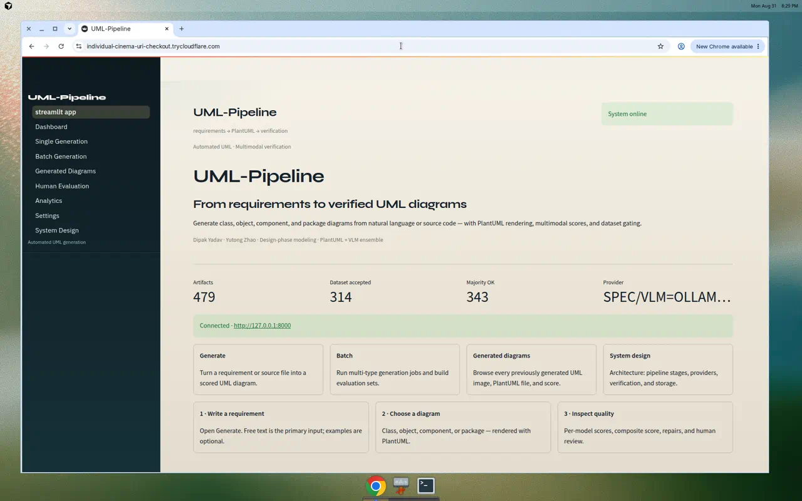

---

## 2. What the thesis specifies

From `paper/main.tex`:

1. A **three-stage pipeline**: natural-language requirement → structured specification → PlantUML → render → image-based evaluation.
2. An **MMMU-weighted composite score S**, with failed renders forced to **S = 0**.
3. A **majority-voting acceptance gate A** on top of S.
4. Comparative evaluation against prior LLM-based UML generators (paper tables).
5. A planned public dataset of (specification, PlantUML, composite score) triples.

The live API and UI support four **design-phase** types: **class, object, component, and package**.

| Signal | Definition used in the application |
|--------|--------------------------------------|
| Per-VLM score | Integer 0–6 |
| Weights | Qwen2.5-VL-3B **53.1**, LLaMA-3.2-Vision-11B **50.7**, Aya-Vision-8B **39.9** |
| Composite **S** | Weighted average of available numeric scores |
| Majority **A** | At least 2 of 3 models ≥ τ = 4 |
| Dataset gate | Render success, **A = 1**, and **S ≥ 3** |

---

## 3. What the application implements

### 3.1 Pipeline

| Stage | Thesis role | Production implementation |
|-------|-------------|---------------------------|
| Input | Natural-language requirements | Also **source code** (Java, Python, C) |
| Stage 1 | Specification LLM | Llama-3.2-1B-Instruct (Ollama) |
| Stage 2 | PlantUML generator | Fine-tuned Qwen2.5-0.5B LoRA (`uml-plantuml-lora-sourcecode-30k`), with repair if validation fails |
| Render gate | PlantUML → PNG | Local Java + PlantUML |
| Stage 3 | Three VLMs | Qwen2.5-VL-3B, LLaMA-3.2-Vision-11B, Aya-Vision-8B (local) |
| Storage | Dataset construction | SQLite + PNG + PlantUML + per-model scores |

**Documented stand-in:** the paper names DeepSeek-R1-Distill-Qwen-32B for Stage 2. Production uses a **0.5B LoRA** adapter trained on UML PlantUML pairs. The **architecture, gates, and VLM ensemble** match the thesis. Numeric parity with the paper’s 32B tables is **not claimed** on this stack.

**Figure 2.** Generate page: requirement or source code, diagram type, and paper scoring (composite S, majority A, dataset gate).

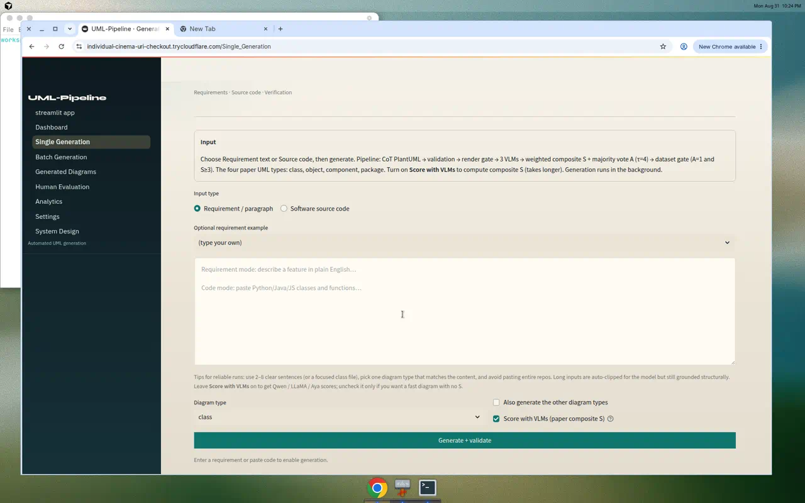

**Figure 3.** System design page: UI and API share one orchestration service (providers, PlantUML render, SQLite + PNG).

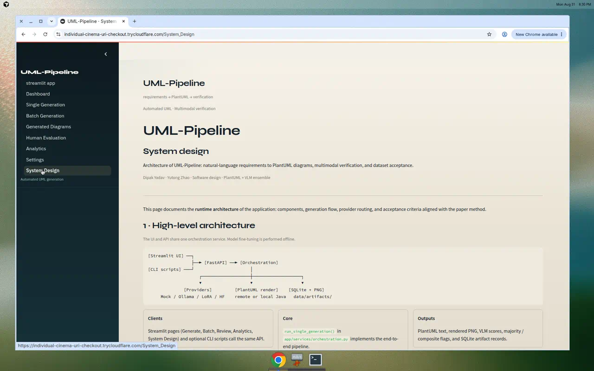

### 3.2 User-facing pages

| Page | Role |
|------|------|
| Generate | One requirement or source file → UML + scores |
| Batch | Many inputs × diagram types |
| Generated diagrams | Gallery of images, PlantUML, S and A |
| Human evaluation | Thesis-aligned 1–5 rubric (semantic, structural, syntactic, coherence) |
| Analytics | Counts, score distributions, export |
| Settings | Live health of models and render stack |

**Figure 4.** Settings / health: production provider is Ollama VLMs + fine-tuned LoRA code model; Aya-Vision-8B is local; Java and PlantUML are available.

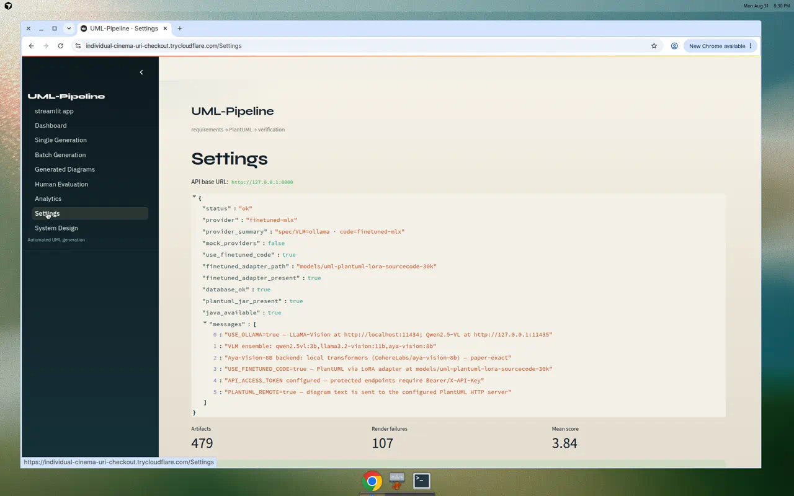

### 3.3 Production server and live access

The application runs continuously on the department Mac Studio. Public access (as of 2026-08-31; tunnel URLs change if tunnels restart):

- **UI:** https://individual-cinema-uri-checkout.trycloudflare.com
- **API:** https://hypothetical-advanced-meanwhile-wow.trycloudflare.com

Current URLs are also in `Link.md` at the repository root.

---

## 4. Screen prints of generated diagrams

These images are from the live server on 2026-08-31 (natural-language class diagrams, then all four types recovered from one Java source file).

**Figure 5.** Dashboard showing recent live artifacts, including a campus-parking class diagram and a class diagram recovered from Java.

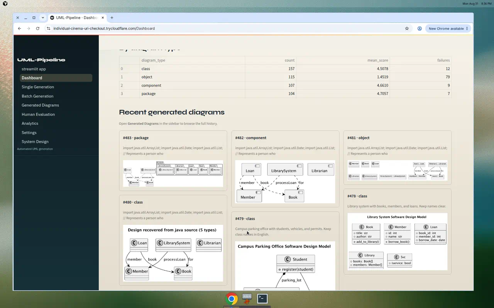

**Figure 6.** Generated-diagrams gallery (newest first). The four-type Java job and the parking class diagram are visible with composite scores.

**Figure 7.** Class diagram from a natural-language requirement (campus parking office).

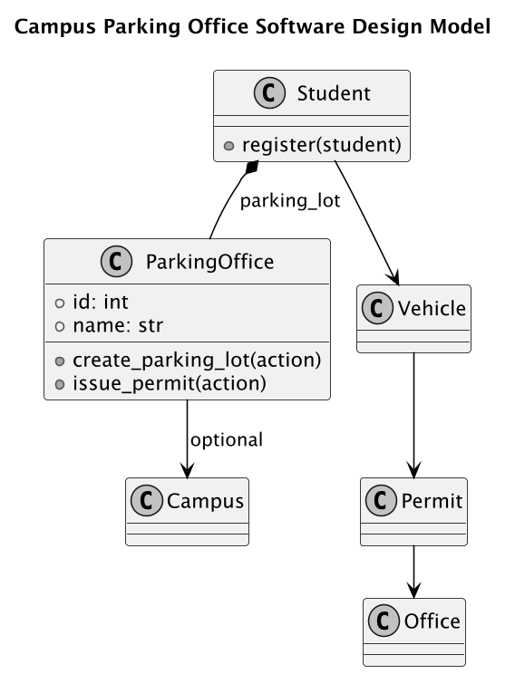

**Figure 8.** Class diagram recovered from Java source (library types).

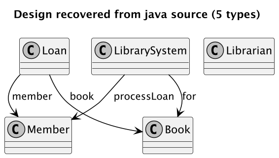

**Figure 9.** Object diagram from the same Java source.

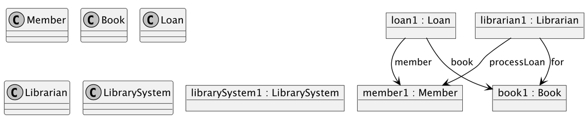

**Figure 10.** Component diagram from the same Java source.

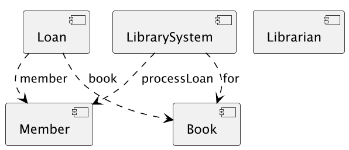

**Figure 11.** Package diagram from the same Java source.

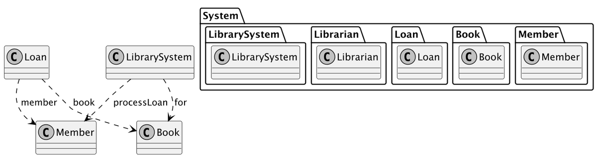

**Figure 12.** Additional class diagram from a natural-language library requirement.

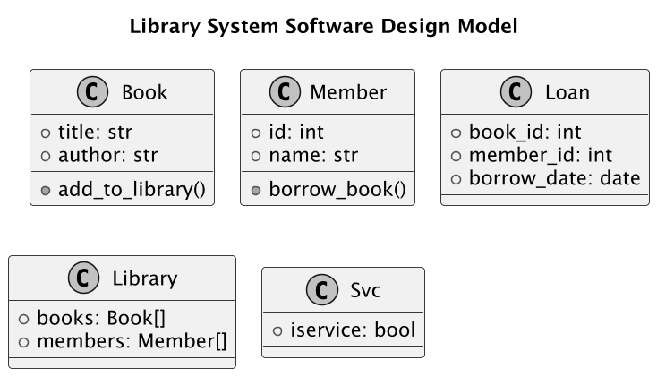

---

## 5. Evaluation

### 5.1 Automated tests

`make test` (mock providers, no live VLMs): **153** tests on `main`.  
Golden fixtures: **6** natural-language + **15** source-code = **21** cases.

### 5.2 Live smoke on the Mac Studio

Nine default Java / Python / C source-code cases on the production LoRA + three-VLM stack: render **9/9**, language detection **9/9**, composite **S** about **4.72–6.00**, majority **A** on passing cases.

These smoke jobs are **not** a re-run of the paper’s large-n DeepSeek-32B tables.

### 5.3 Live check on 2026-08-31

- Health: `ok`; spec/VLM = Ollama; code = fine-tuned LoRA.
- Natural-language class (campus parking): render success, **S ≈ 5.65**, majority accepted, all three VLMs scored (Qwen 6, LLaMA-Vision 5, Aya 6).
- One Java source file → class, object, component, package: all four rendered; all three VLMs scored.

**Figure 13.** Analytics on the live database (503 artifacts at capture time; majority acceptance 73.2%; human–AI correlation not yet available).

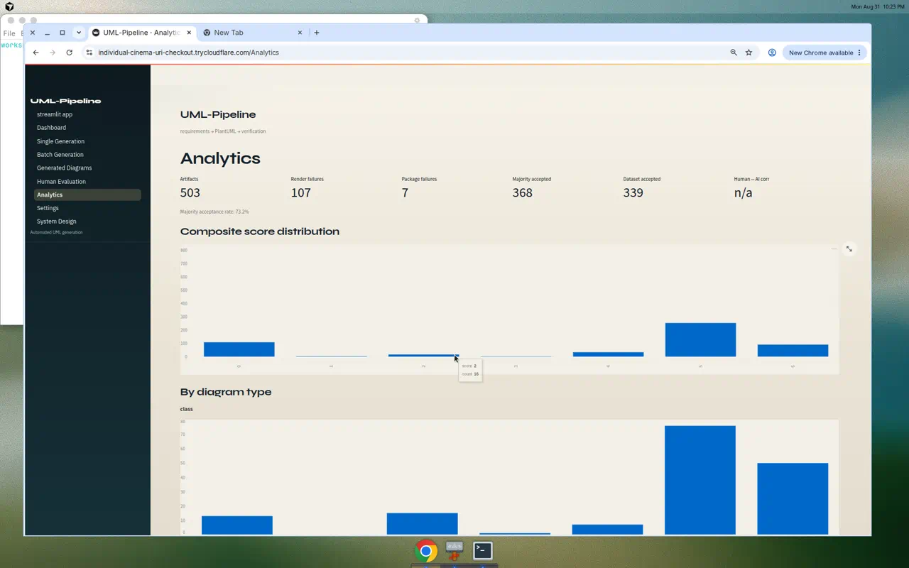

### 5.4 Human evaluation (ready; study not yet run)

The UI implements the thesis rubric (semantic, structural, syntactic, coherence; 1–5). A large-n human–AI correlation study has **not** been completed.

**Figure 14.** Human evaluation page: thesis-aligned rubric and sliders for a stored artifact.

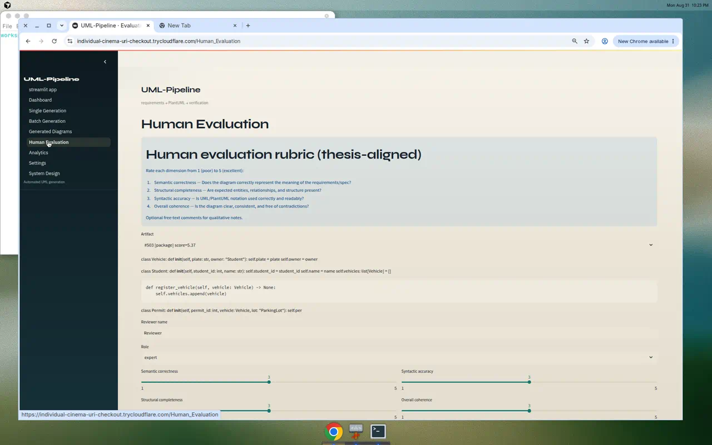

### 5.5 Paper-scale numbers (from the paper, not re-measured here)

Paper tables (DeepSeek-32B pipeline, large n): render success about **94.4%**, mean **S ≈ 3.85**, majority acceptance about **91.3%**. Those figures are **not** re-verified on the LoRA stack.

---

## 6. Training used in production

Production PlantUML generation uses a LoRA adapter trained on a **30k** Java / Python / C source-code UML corpus (6,000 iterations), after earlier 50k / 100k / 200k UML PlantUML runs. That adapter is what the live Settings page reports as `uml-plantuml-lora-sourcecode-30k`.

---

## 7. Paper contribution → software status

| Paper item | In the application? | Status |
|------------|---------------------|--------|
| Three-stage pipeline | Yes | Live on the Mac Studio |
| NL → spec → PlantUML | Yes | Also source-code input |
| Four design-phase UML types | Yes | Class, object, component, package |
| PlantUML render as a hard gate | Yes | Failed render → S = 0 |
| Three VLMs + MMMU weights | Yes | Qwen, LLaMA-Vision, Aya |
| Composite S + majority A | Yes | Same τ and dataset rule |
| Human evaluation protocol | UI + rubric | Large-n study **not run** |
| 8,000-triple public dataset | Batch + export | HuggingFace release **not completed** |
| DeepSeek-32B Stage 2 | Stand-in | 0.5B LoRA; documented |
| Comparison vs five prior systems | Paper tables | Not re-run on this stack |

---

## 8. Remaining work

1. **Stage-2 model size.** Paper: DeepSeek-32B. Production: 0.5B LoRA. Method matches; numbers may not.
2. **Human alignment study.** The evaluation UI exists; correlation with VLM scores is not yet a finished experiment.
3. **Official CSULB thesis format.** A draft exists for advisor review; Thesis Office template and full bibliography are still required.
4. **Public 8k dataset.** Generation and export exist; the paper’s public HuggingFace dump is still a release step.
5. **Object diagrams** remain the weakest of the four types in the stored corpus, though recent live object jobs can succeed.

---

## 9. How to inspect

| What | Where |
|------|--------|
| Live UI | https://individual-cinema-uri-checkout.trycloudflare.com |
| Live API | https://hypothetical-advanced-meanwhile-wow.trycloudflare.com |
| Source | https://github.com/dipak5501/uml-generation-pipeline |
| Paper method | `paper/main.tex` |
| Tests | `make test` |

---

The thesis defines a **multimodal-verified UML generation pipeline**. The repository is that pipeline as a **running application**—UI, API, LoRA generator, three VLMs, and dataset gates—on a department Mac Studio, with a documented Stage-2 stand-in and remaining research work in human correlation and public data release.

---

*Prepared 2026-08-31 for reviewer discussion of the M.S. thesis and the UML-Pipeline application.*
